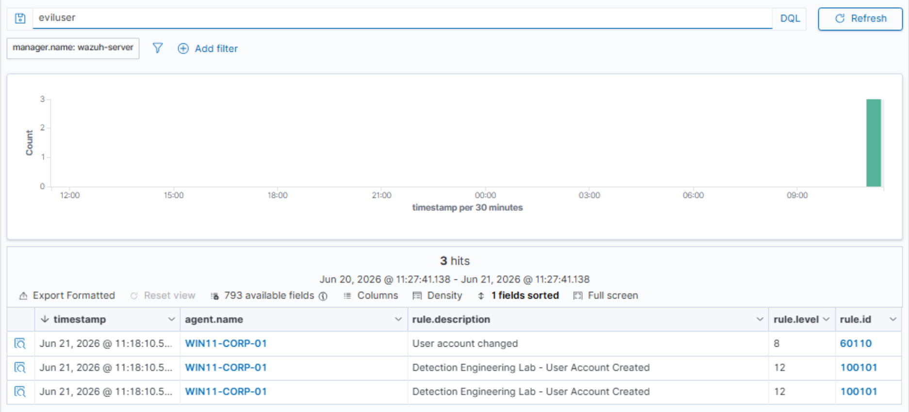
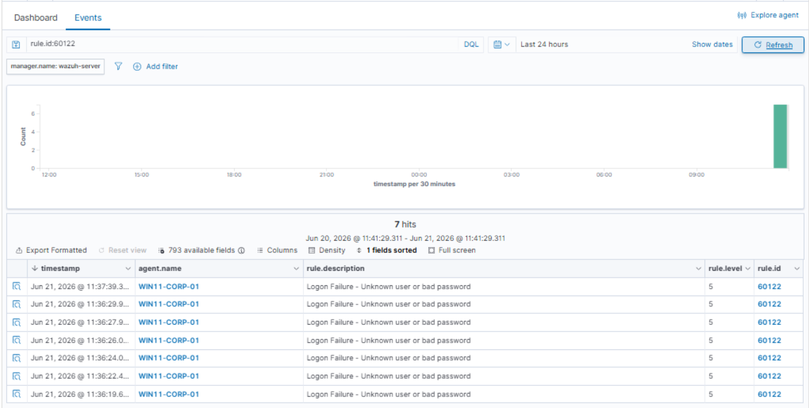
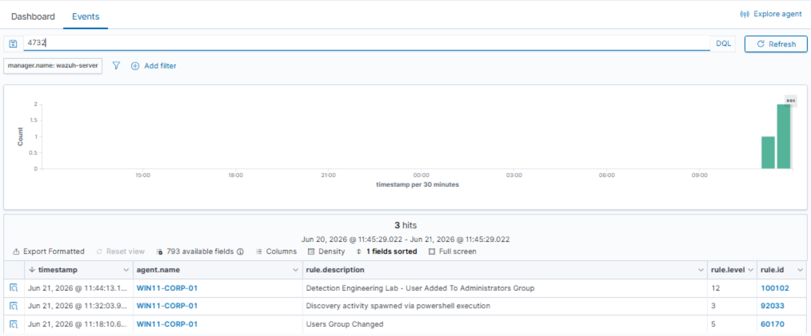

# Active Directory Attack & Defend Lab

## Overview

This project demonstrates the deployment of an Active Directory lab environment integrated with Sysmon and Wazuh for detection engineering, threat hunting, and security monitoring.

The lab simulates common attacker behavior including account creation, privilege escalation, reconnaissance activity, failed logons, PowerShell execution, and malware-related events. Security telemetry is collected through Sysmon and forwarded to Wazuh where detections are analyzed and mapped to MITRE ATT&CK techniques.

---

## Lab Objectives

- Build an Active Directory environment
- Deploy a Windows Server 2022 Domain Controller
- Join a Windows 11 workstation to the domain
- Install and configure Sysmon
- Install and configure the Wazuh agent
- Simulate attacker techniques
- Generate security events
- Perform threat hunting investigations
- Map detections to MITRE ATT&CK

---

## Technologies Used

- Windows Server 2022
- Windows 11
- Active Directory Domain Services
- Sysmon
- Wazuh
- PowerShell
- MITRE ATT&CK
- VMware Workstation

---

## Lab Architecture

Domain Controller (Windows Server 2022)
↓
Active Directory
↓
Windows 11 Workstation
↓
Sysmon
↓
Wazuh Agent
↓
Wazuh Manager

---

## Active Directory Deployment

### Domain Controller Setup

### Domain Workstation Joined to Domain

---

## Sysmon and Wazuh Deployment

### Sysmon Installation

### Wazuh Agent Registration

---

## Attack Simulations

### Encoded PowerShell Execution

### User Account Creation

### Failed Logon Activity

### Privilege Escalation

---

## Detection Events

### User Account Creation Detection

### Failed Logon Detection

### Malware Drop Detection

### Administrator Group Detection

---

## Threat Hunting

### Failed Logon Investigation

### User Account Investigation

### Malware Alert Investigation

---

## MITRE ATT&CK Mapping

### ATT&CK Overview

### User Account Creation Mapping

Mapped Technique:

- T1136 – Create Account

---

## Wazuh Dashboard

---

## Skills Demonstrated

- Active Directory Administration
- Windows Security Monitoring
- Detection Engineering
- Threat Hunting
- Security Event Analysis
- Sysmon Configuration
- Wazuh Administration
- MITRE ATT&CK Mapping
- Security Investigations
- Log Analysis

---

## Resume Highlights

- Built an Active Directory attack and defense lab using Windows Server 2022, Windows 11, Sysmon, and Wazuh.
- Developed custom detections for user creation and administrator group membership changes.
- Performed threat hunting investigations using Wazuh event telemetry and Sysmon logs.
- Mapped detections to MITRE ATT&CK techniques to improve detection coverage and analysis.